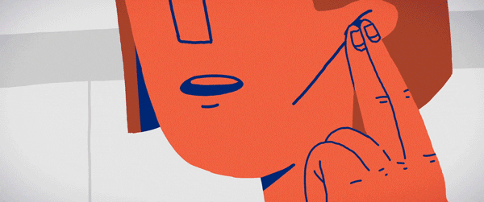

<!DOCTYPE html>
<html lang="en" data-theme="dark" data-portal-theme="clean" data-portal-style="glass">
<head>
<meta charset="UTF-8">
<meta name="viewport" content="width=device-width, initial-scale=1.0">
<title>Service Restricted</title>

</head>

<body data-theme="dark" data-portal-theme="clean" data-portal-style="glass">

<h2>Service Temporarily Restricted</h2>

Your internet service has been temporarily suspended due to an unpaid balance.
Please settle your account to restore access.

💳 PAY NOW

💬 Contact Support

© 2026 YOUR BRAND | Secure Access Portal

✖
<h3 id="qrTitle">Scan to Pay</h3>

XXXXXXXXXXXXX

XXXXXXXXXXXXX

<button class="copy-btn" onclick="copyQRNumber(this)">COPY NUMBER</button>

Once the payment has been sent, kindly provide the account name and
reference number through Messenger or SMS.
  Facebook: FACEBOOK PAGE
 Phone: 0912-345-6789

✖
<h3>Contact Support</h3>

<a href="tel:+639123456789" class="option-btn call-btn">
📞 Call Now
</a>

<button type="button" class="option-btn text-btn" onclick="copyContactNumber(this)">
📋 Copy Number
</button>

<audio id="bgMusic" autoplay loop>
<source src="Audio1.mp3">
</audio>

</body>
</html>
